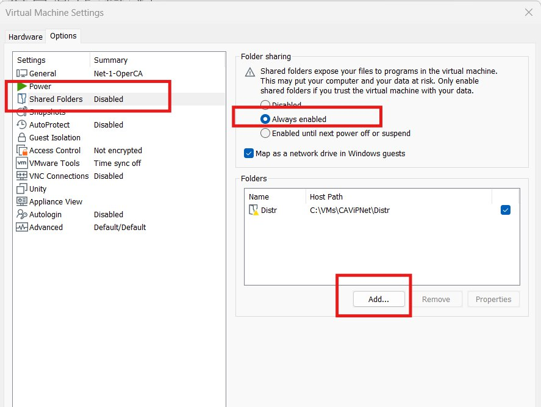
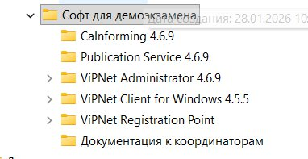
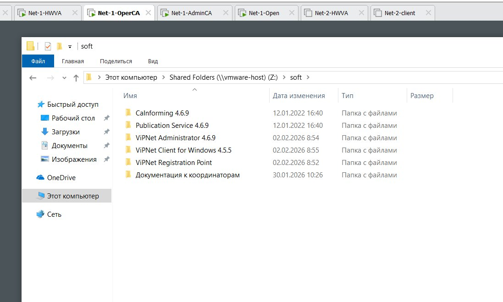
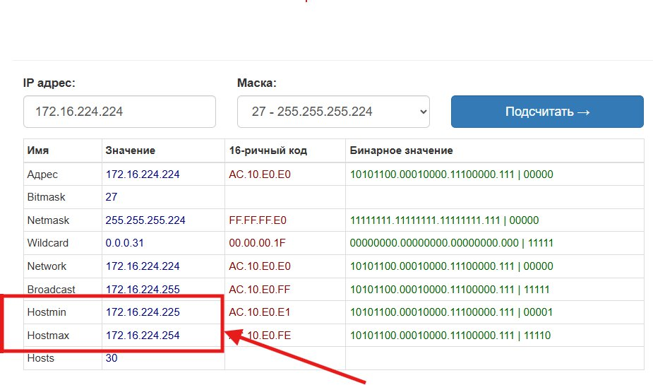
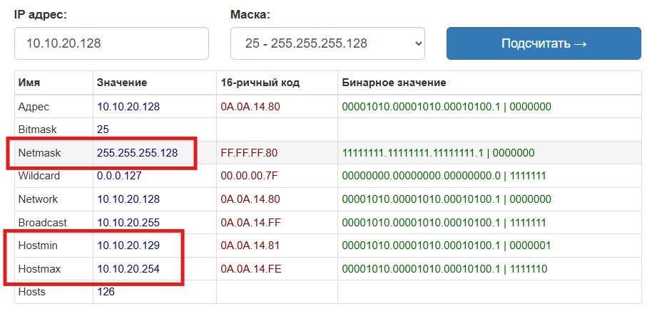
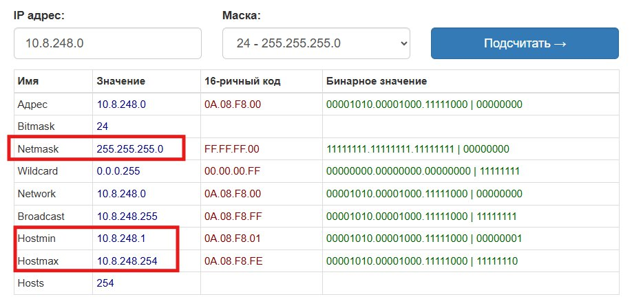
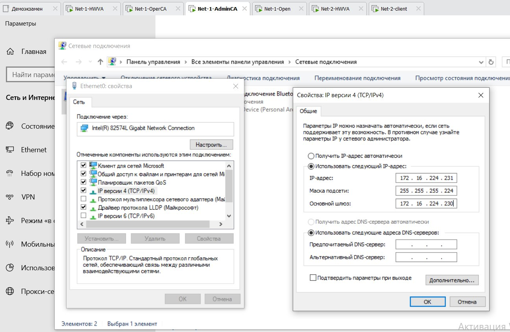
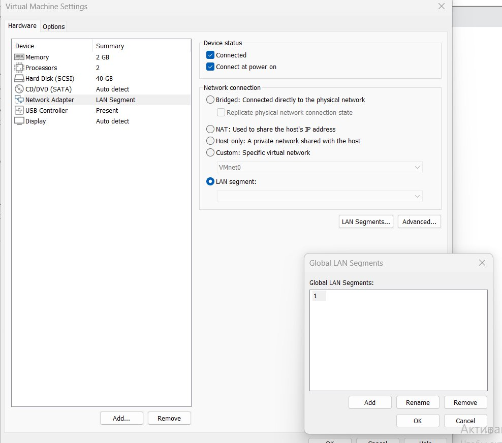
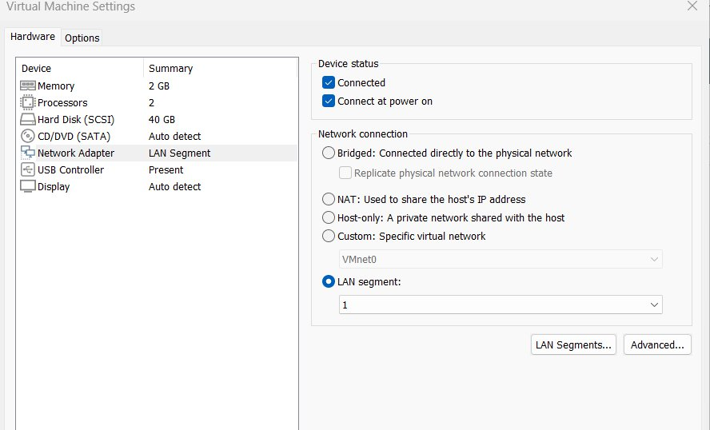
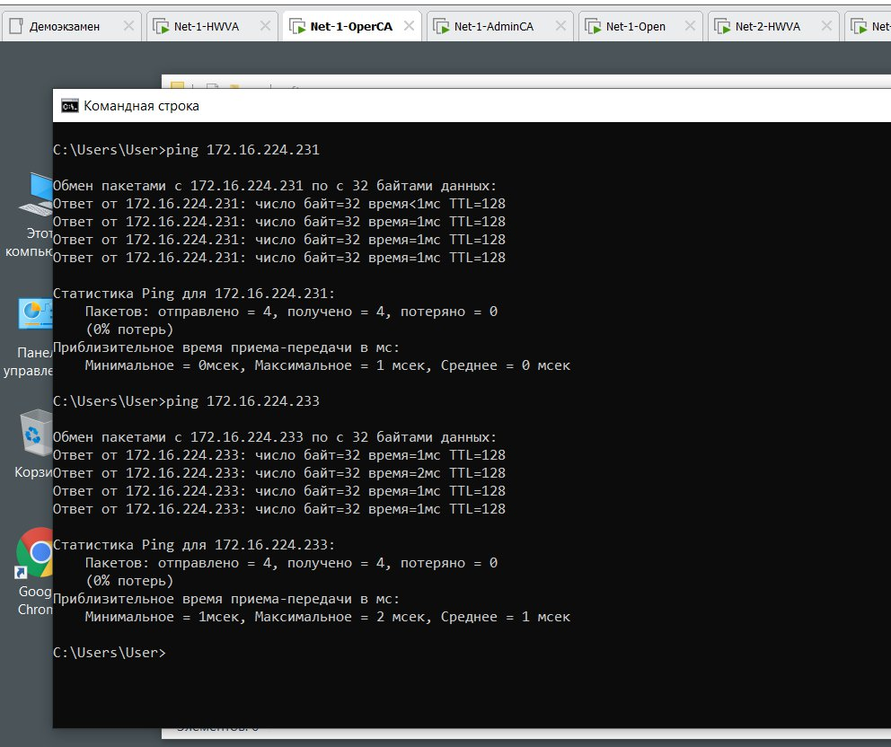

[🏠 Главная](index.md)

# Подготовка

Цель: раскидать софт и ключи по машинам, настроить IP-адреса и сегменты, проверить связь внутри сегментов.

## 1. Общие папки (раскидываем софт)

Софт и ключи удобно копировать через общую папку VMware. Варианты:

- если установлены **VMware Tools** — софт можно просто **копировать** на машины с Windows;
- если установлены **VMware Tools + общая папка** — софт можно открывать прямо из общей папки.

На каждой ВМ с Win10 зайти в **Настройки → Общие папки**:

Удаляем из списка старый путь и добавляем новый:

Указываем папку, в которой лежат все дистрибутивы и лицензии:

Пишем короткое имя (**Name**), например `soft`:

> Можно раскидать софт и через флешку, но это значительно дольше.

## 2. IP-адресация

Настраиваем IP-адреса по заданию:

- Центральный офис «Сеть 1 ЦО»: `172.16.224.224/27` — Net1-AdminCA, Net1-OperCA, Net1-Open, Net1-Coord
- Офис филиал «Сеть 1 Филиал»: `10.10.20.128/25` — Net2-Coord, Net2-Client
- Офис «Сеть 2»: `192.168.88.64/26`
- «Интернет» для координаторов: `10.8.248.0/24` — Net1-Coord, Net2-Coord

Чтобы понять, какие адреса можно выдавать по маске, используем любой онлайн IP-калькулятор, например `https://ip-calculator.ru`.

Для `172.16.224.224/27`:

Минимальный адрес `172.16.224.225`, максимальный `172.16.224.254`.

Для филиала `10.10.20.128/25`:

Минимальный адрес `10.10.20.129`, максимальный `10.10.20.254`.

Считаем адаптеры координаторов, смотрящие наружу (у координатора два адаптера — один внутрь, один наружу):

### Итоговый план (отчёт)

**«Сеть 1 ЦО» `172.16.224.224/27`** (маска `255.255.255.224`)

| Узел | IP |
|------|----|
| Net1-Coord | `172.16.224.230` |
| Net1-AdminCA | `172.16.224.231` |
| Net1-OperCA | `172.16.224.232` |
| Net1-Open | `172.16.224.233` |

**«Сеть 1 Филиал» `10.10.20.128/25`** (маска `255.255.255.128`)

| Узел | IP |
|------|----|
| Net2-Coord | `10.10.20.130` |
| Net2-Client | `10.10.20.131` |

**«Интернет» координаторов `10.8.248.0/24`** (маска `255.255.255.0`)

| Узел | IP |
|------|----|
| Net1-Coord | `10.8.248.10` |
| Net2-Coord | `10.8.248.20` |

Прописываем IP всем виртуальным машинам, **начиная с сети 1** (HW-VA пока не трогаем).

- Шлюз в «Сети 1 ЦО» = IP **Net1-Coord** (`172.16.224.230`).
- Шлюз в «Сети 1 Филиал» = IP **Net2-Coord** (`10.10.20.130`).

## 3. Сегменты ВМ

В настройках ВМ выставляем, каким сегментам они принадлежат (1, 2):

## 4. Брандмауэр и проверка связи

> ⚠️ На всех Windows-машинах **выключаем Брандмауэр!** (или проверяем, что он уже выключен).

Пингуем машины **внутри** сегментов. Машины из разных сегментов пока **не** пингуются — потому что ещё не настроены HW-VA (координаторы), которые обеспечивают маршрутизацию между сетями.

> 💡 На HW-VA позже настроим два сетевых интерфейса: один смотрит внутрь своего сегмента, второй — наружу (маршрутизация между сетями; для наружного адаптера важно указать шлюз вашей аудиторной/домашней сети).

После настройки сегментов и успешного пинга внутри одного сегмента — приступаем к заданиям.

---

| ⬅️ Назад | 🏠 | Вперёд ➡️ |
|---|---|---|
| [Главная](index.md) | [Содержание](index.md) | [Задание 1.1 — MSSQL](01-zadanie-1-1-mssql.md) |
