[🏠 Главная](index.md)

# Задание 1.1 — установка базы данных MSSQL на Net1-Open (незащищённый узел)

Идём на ВМ **Net1-Open**. Копируем софт (обратите внимание на путь — где находится установщик):

```
Z:\soft\ViPNet Administrator 4.6.9\ЦУС\Server Install\Packages\SqlExpress2014\SQLEXPR_x64_ENU.exe
```

> Установщик SQL входит в дистрибутив ViPNet и открывается из общей папки `soft`
> (диск `Z:` = Shared Folders `\\vmware-host`). Запускаем `SQLEXPR_x64_ENU` (x64).

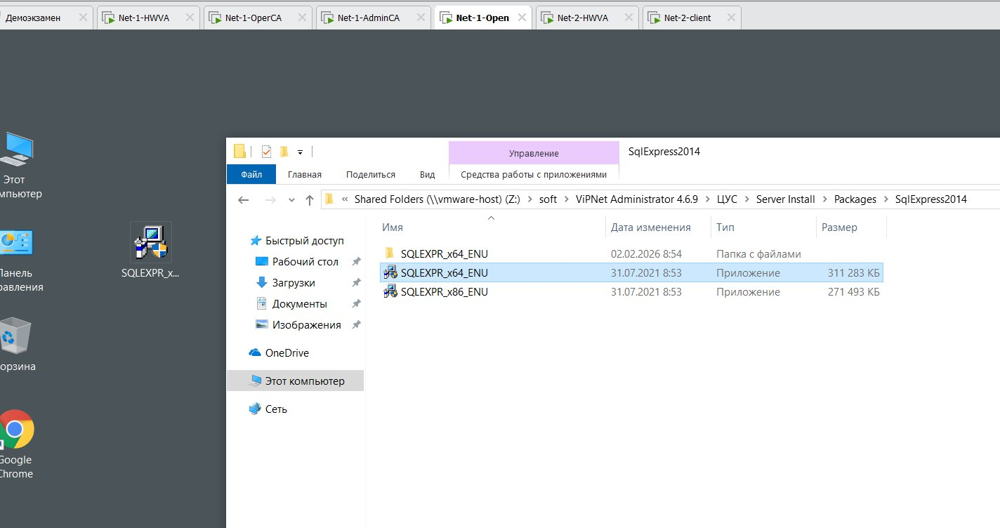

После копирования запускаем установку.

> Пока идёт первичная установка — параллельно копируем остальной софт по машинам:
>
> | Машина | Софт |
> |--------|------|
> | Net1-AdminCA | ViPNet Administrator (ЦУС-сервер, УКЦ), ViPNet Client, ViPNet CA Informing |
> | Net1-Open | MS SQLEXPR_x64_ENU, ЦУС-клиент |
> | Net1-OperCA | ViPNet Client, ViPNet Registration Point, ViPNet Publication Service |
> | Net2-Client | ViPNet Client |

## Установка SQL Server

Выбираем **New SQL Server** (новая установка):

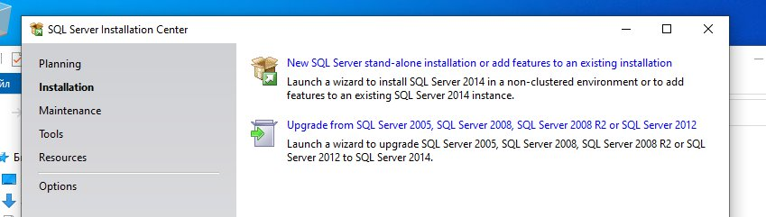

Соглашаемся с лицензией:

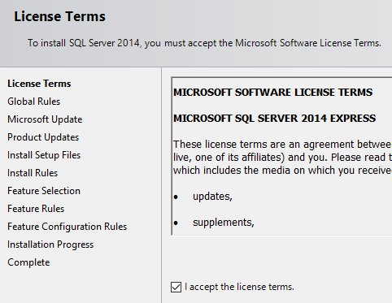

Нажимаем везде **Next** до окна конфигурации. Не пугаемся, что «ругается» на обновления:

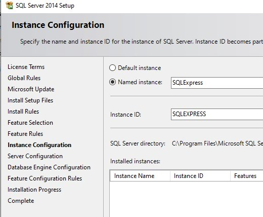

Меняем имя на **`WINNCCSQL`** в двух местах:

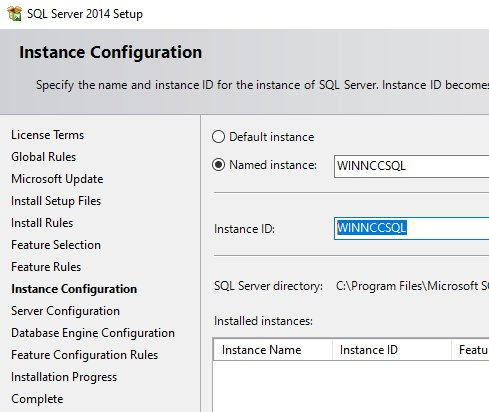

В следующем окне меняем тип запуска на **Автоматический**:

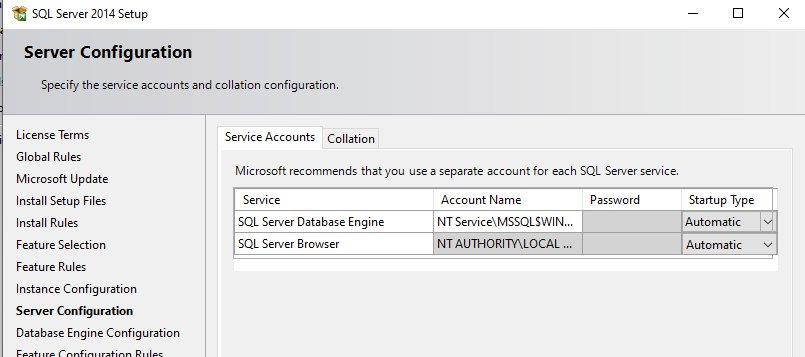

Меняем аутентификацию с **Windows** на **смешанную/ручную** (SQL Server Authentication):

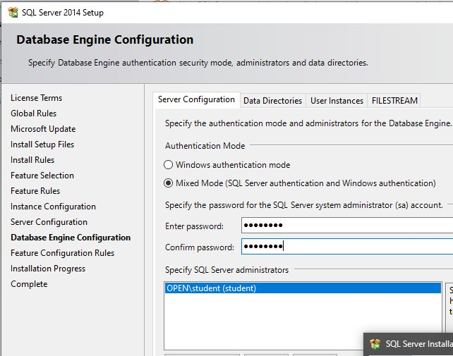

> 💡 В любом софте, который требует SQL-базу от Microsoft, нужно менять эту настройку — это база, запомнить на всю IT-жизнь.

- Пароль ставим такой, чтобы **не забыть**, например `xxXX1234`.
- Обратите внимание: пользователь называется **`sa`**.

На вкладке **FILESTREAM** включаем нужные настройки:

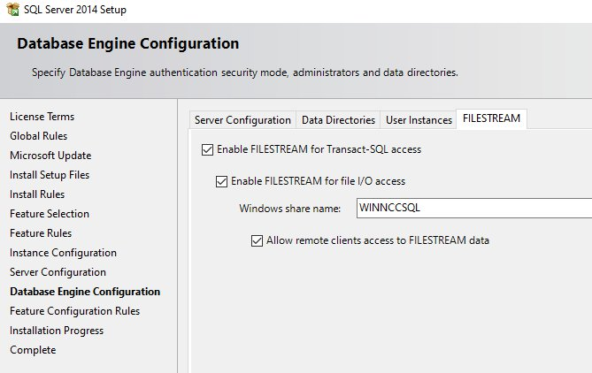

Нажимаем **Next** — пойдёт установка.

## Параллельно: установка клиентов / ЦУС

Пока ставится БД, можно устанавливать клиентов на **Net1-AdminCA, Net1-OperCA, Net2-Client**.

Путь к ViPNet Client (если софт на Рабочем столе):

```
C:\Users\student\Desktop\ViPNet Client for Windows 4.5.5\Комплект пользователя\RUS\Software
```

Запускаем клиента:

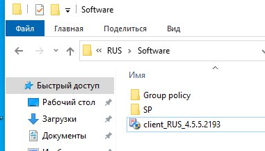

Всё по умолчанию → **Перезагрузить сейчас**. После загрузки появится запрос о ключах — нажимаем пока **Нет**.

Также на **Net1-AdminCA** можно начать ставить **ЦУС**. Путь:

```
C:\Users\student\Desktop\ViPNet Administrator 4.6.7_R1\Комплект пользователя\ГОСТ\Soft\Центр управления сетью\Server Install → Setup
```

По умолчанию выбираем всё до окна выбора подключения к базе данных:

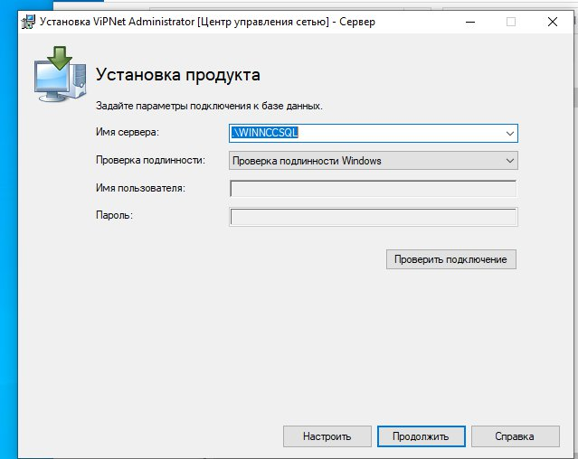

## Включаем TCP/IP для SQL и проверяем подключение

Возвращаемся на **Net1-Open**. Нажимаем **Close**, закрываем окна установки БД.
**Пуск → SQL Server Configuration…**:

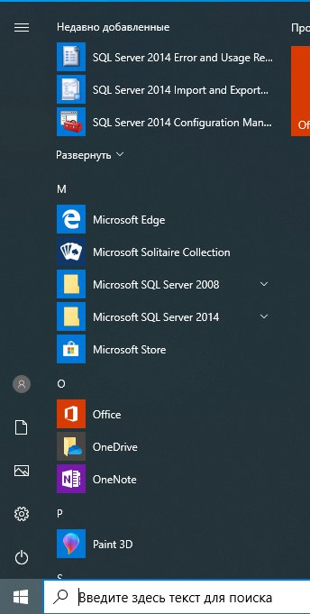

Включаем протокол **TCP/IP → Включено (Enabled)**:

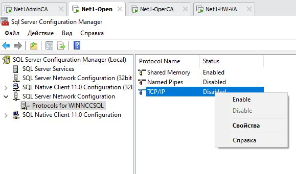

Идём в **Сервис сервера → рестарт**:

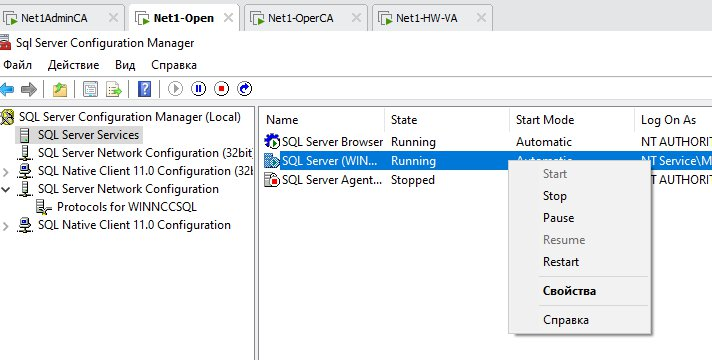

Возвращаемся на **Net1-AdminCA** (окно установки ЦУС). В имени сервера пишем **IP-адрес Net1-Open**, выбираем **Проверка подлинности SQL Server**, пользователь `sa`, пароль — тот, что задали при установке БД (например `xxXX1234`):

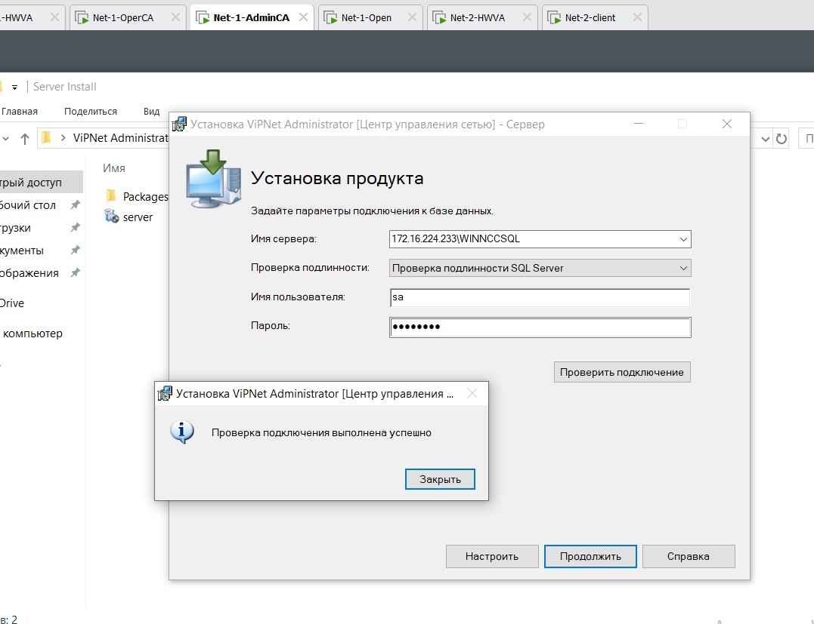

Запускаем **Проверку подключения** — должна пройти успешно. Нажимаем **Продолжить**.

## ЦУС-клиент на Net1-Open и УКЦ на Net1-AdminCA

На **Net1-Open** устанавливаем **Клиент ЦУС**:

```
C:\Users\student\Desktop\ViPNet Administrator 4.6.7_R1\Комплект пользователя\ГОСТ\Soft\Центр управления сетью\Client Install → setup
```

Всё по умолчанию.

На **Net1-AdminCA** ставим **УКЦ**. Путь до дистрибутива:

```
C:\Users\student\Desktop\ViPNet Administrator 4.6.7_R1\Комплект пользователя\ГОСТ\Soft\Удостоверяющий и ключевой центр
```

Готовим лицензию для первой сети (примерный вид):

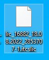

> ✅ База MSSQL установлена, ЦУС подключён к ней, клиенты и УКЦ устанавливаются. Переходим к настройке ЦУС/УКЦ.

---

| ⬅️ Назад | 🏠 | Вперёд ➡️ |
|---|---|---|
| [Подготовка](00-podgotovka.md) | [Содержание](index.md) | [Задание 2.1 — ЦУС и УКЦ](02-zadanie-2-1-cus-ukc.md) |
