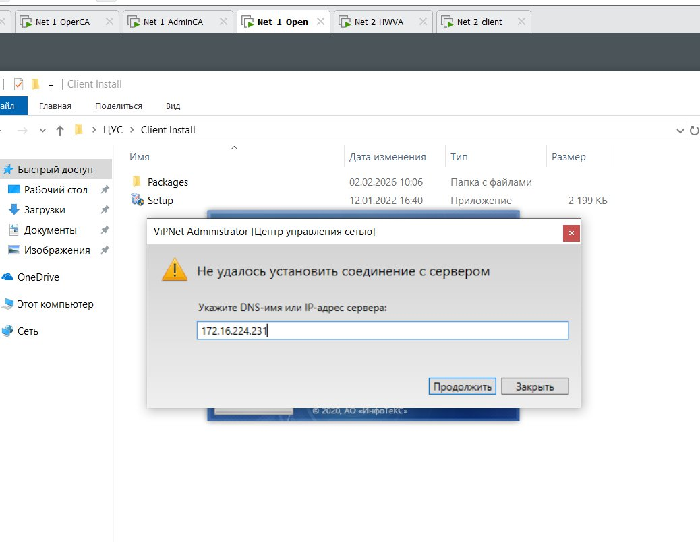
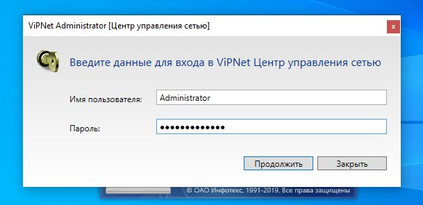
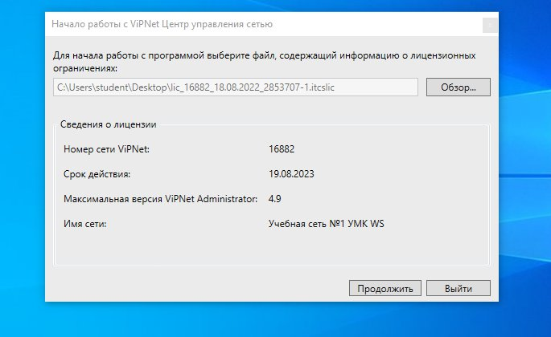
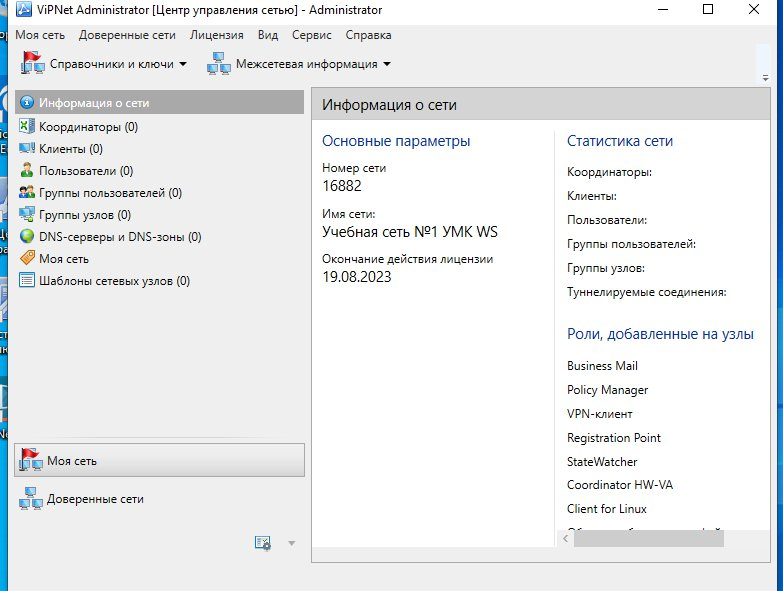
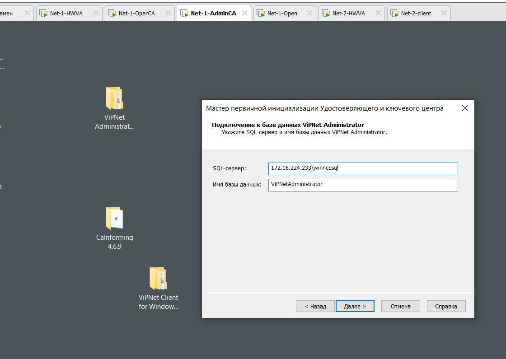
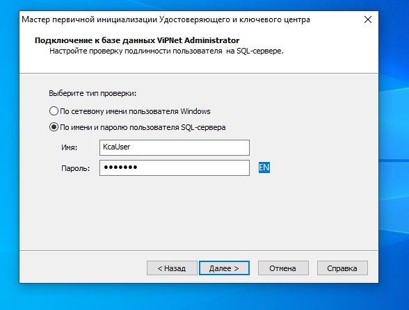
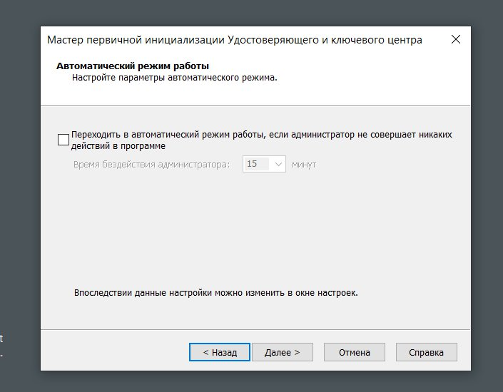
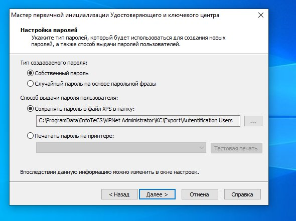
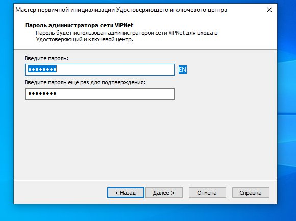
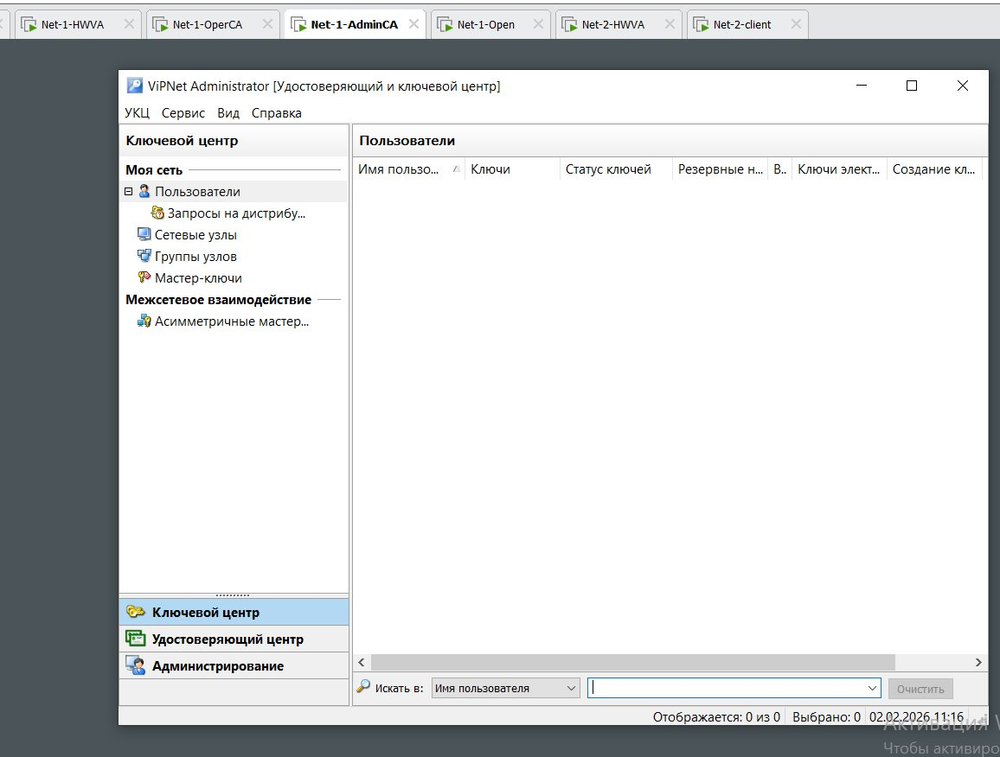

[🏠 Главная](README.md)

# Задание 2.1 — первый запуск и настройка ЦУС + УКЦ

## Первый запуск ЦУС (на Net1-Open)

Запускаем **ЦУС**:

Вводим данные входа:

- Имя пользователя и пароль при первом запуске — **`Administrator`**.
- Затем пароль **обязательно меняем** и записываем актуальный пароль в **Отчёт**
  (для практических/чемпионатных работ это обязательно; в реальной организации пароль не записывают).

Присоединяем лицензию:

**Продолжить → Настроить сеть самостоятельно.** Загрузится ЦУС:

## Запуск и настройка УКЦ (на Net1-AdminCA)

Сразу запускаем **УКЦ** на Net1-AdminCA.

Для работы «Электронной рулетки» **двигаем мышкой** и можно нажимать клавиши — так генерируется пароль.

Для подключения к базе данных пишем **IP-адрес Net1-Open**:

Соглашаемся:

Далее → Далее → … пока ничего нигде не вводим, всё по умолчанию.

Снимаем галочку:

Меняем тип на **Собственный пароль**:

Ставим пароль (и **записываем в отчёт**):

Далее → Далее. Загрузится окно УКЦ:

Сворачиваем пока УКЦ.

> ✅ На этом моменте **Задание 2.1 выполнено**. Далее — Задания 2.2 и 2.3 (работа с координаторами).

---

| ⬅️ Назад | 🏠 | Вперёд ➡️ |
|---|---|---|
| [Задание 1.1](01-zadanie-1-1-mssql.md) | [Содержание](README.md) | [Задание 2.2/2.3 — Координаторы](03-zadanie-2-2-koordinatory-klyuchi.md) |
