[🏠 Главная](README.md)

# Задание 3.1–3.3 — настройка координаторов HW-VA, VPN, чат и почта

## Подготовка dst-файлов

Есть два варианта работы с dst-файлами для координаторов: **iso-файл** или **флешка**:

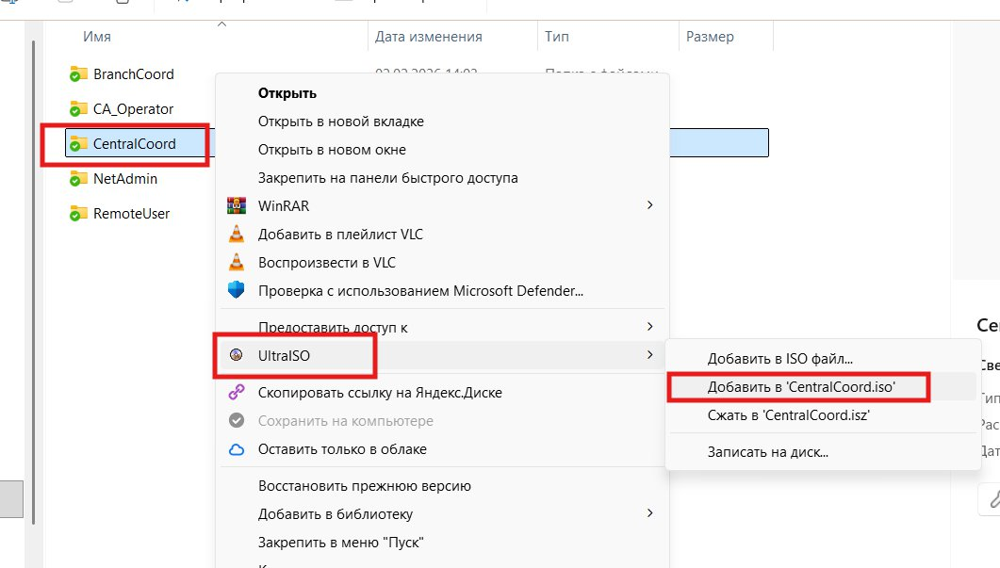

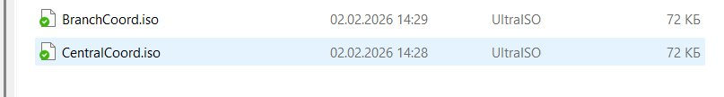

На флешку скидываем dst-файлы для координаторов.
> ⚠️ Не перепутать, какой dst-файл для какого координатора!

Подсоединяем флешку к **Net1-HW-VA**:

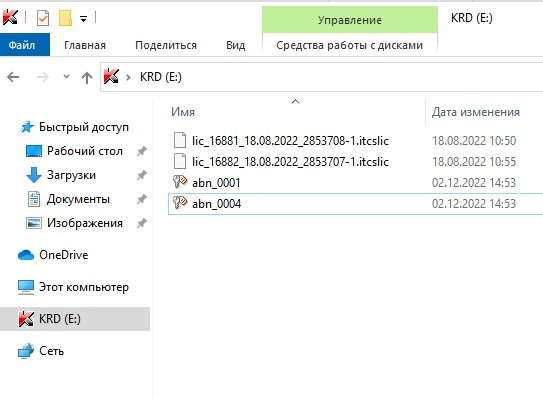

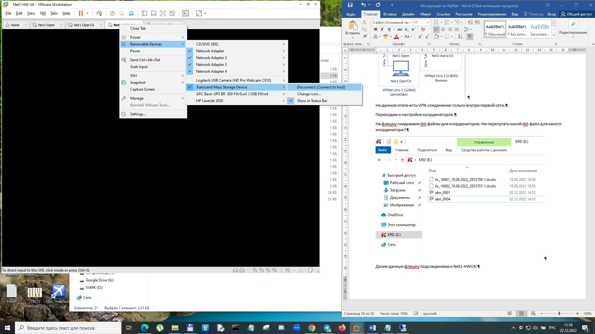

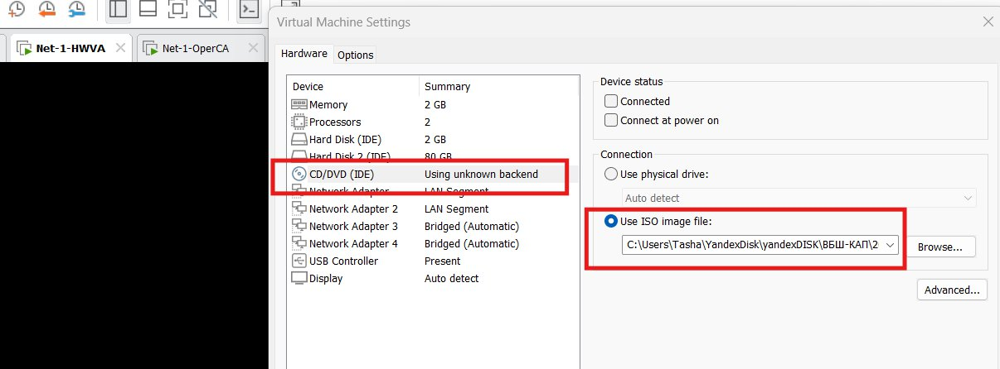

> ⚠️ После настройки **не забыть приконнектить CD**.

## Инициализация первого координатора (Net1-HW-VA)

Логин **`user`**, пароль **`user`**.

> ⌨️ В Linux **пароли не отображаются звёздочками**. Вся работа с клавиатуры: стрелки, Enter, Пробел (выбор), Tab (перемещение).

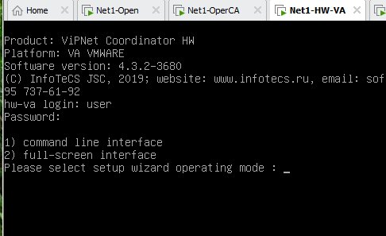

Нажимаем **2** → окно лицензии → **Yes**.
Далее **Next → Европа → Россия → часовой пояс (Москва)**:

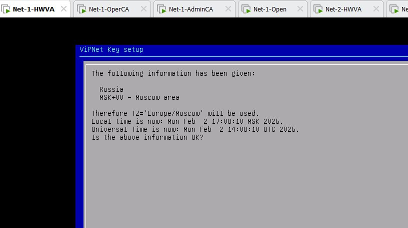

Проверяем дату → **Next**. Выбираем **cd → далее**.

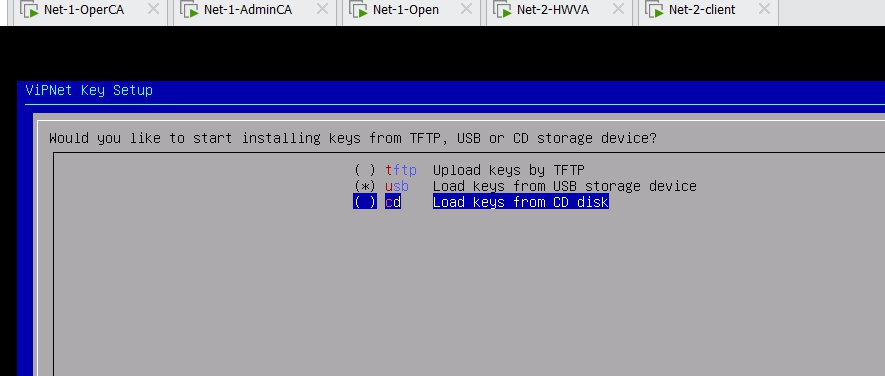

Выбираем dst-файл для **координатора офиса**. Далее **Next**, набираем пароль.
Соглашаемся с инициализацией сетевого интерфейса. Выбираем (стрелки + Пробел) **статический IP**:

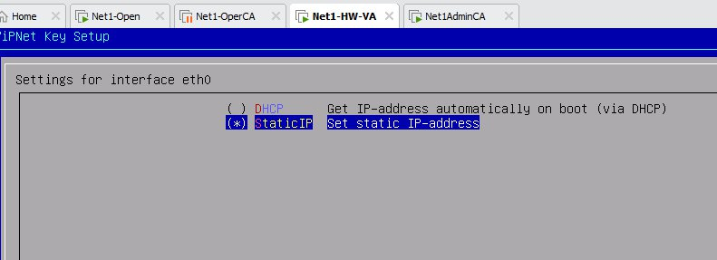

Настраиваем **два сетевых интерфейса**: один в сегменте 1, второй в сегменте 3:

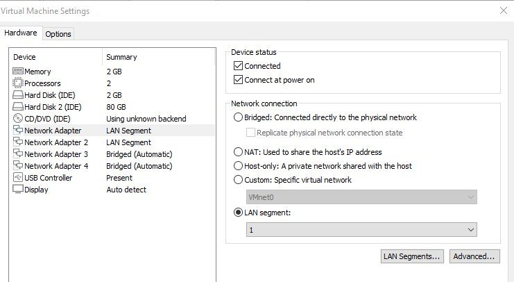

> У первого координатора два интерфейса: сегмент 1 смотрит в свою 1-ю сеть; сегмент 3 соединяет два координатора в одну сеть.

**Первый интерфейс (сегмент 1):** `172.16.224.230` (маска `255.255.255.224`):

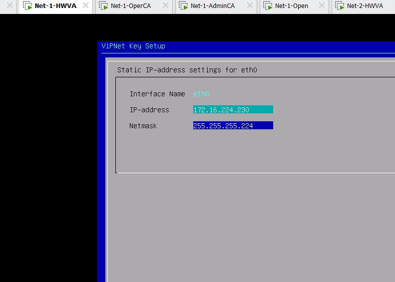

Активируем. Снова выбираем статический адрес.
**Второй интерфейс (сегмент 3, «Интернет»):** `10.8.248.10` (маска `255.255.255.0`) → **Активировать**:

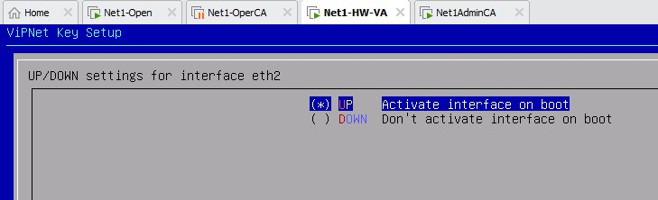

> 3-й и 4-й адаптеры **НЕ** активируем.

Появится запрос на IP шлюза:

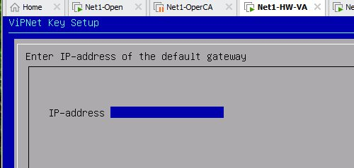

Шлюзом указываем **IP второго координатора**:

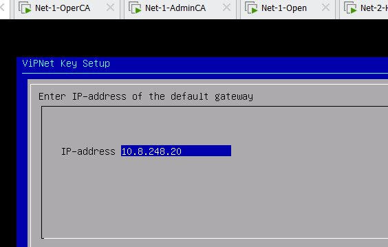

Далее → далее. Переименовываем координатор:

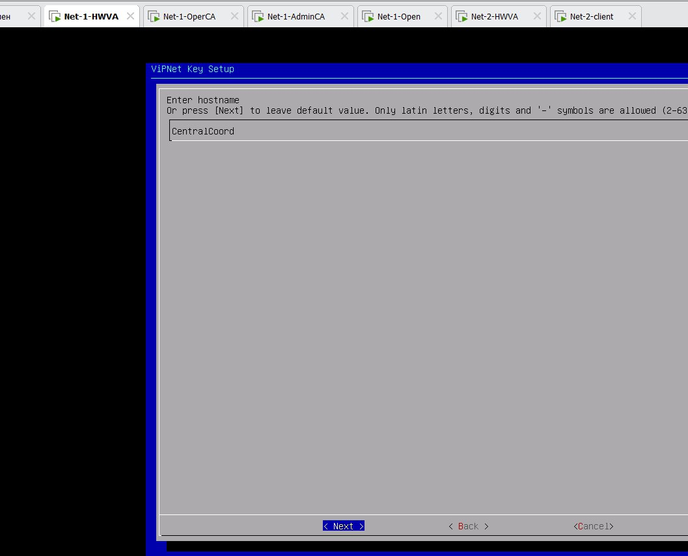

Далее → далее (ничего не меняем) → **Yes** (соглашаемся на фаервол).

## Настройка соединения между координаторами

Выбираем вторую строку:

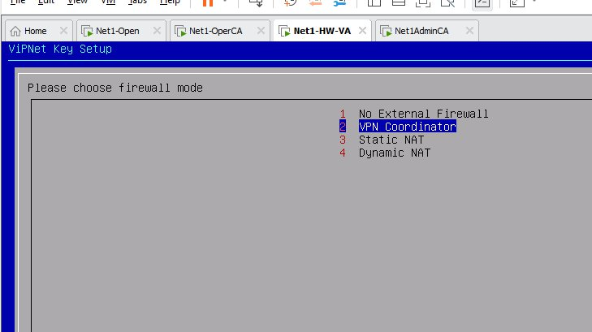

Далее → далее. Выбираем интерфейс, настроенный на «Интернет» (для связи между координаторами):

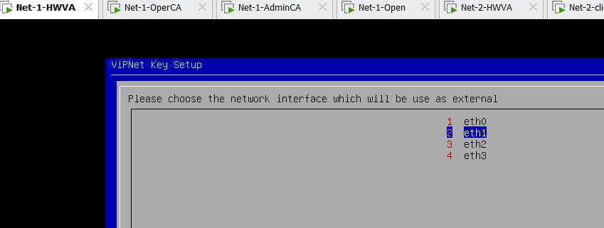

В списке появляется наш второй координатор:

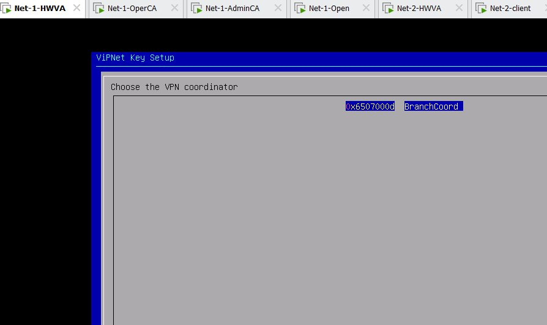

Для проверки выбираем **Админа** (у него всё настроено):

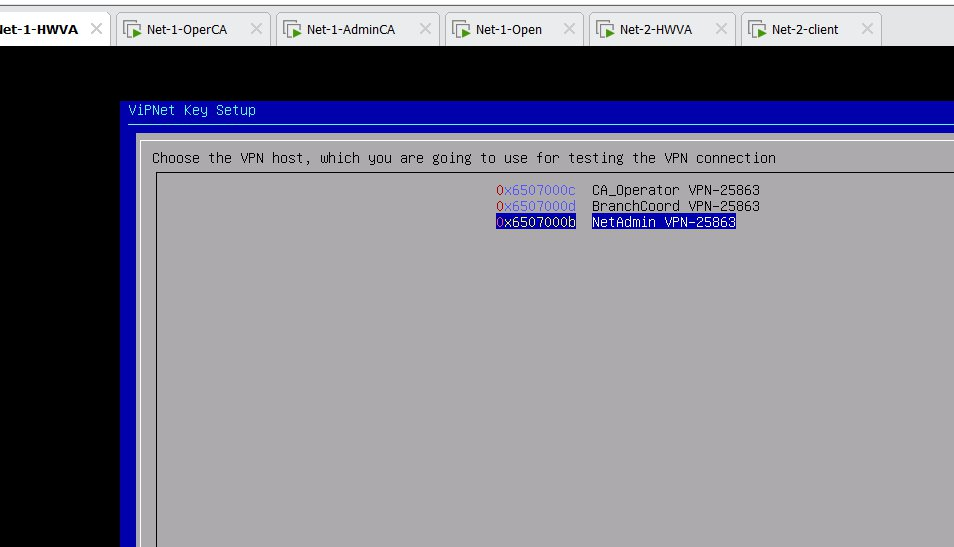

Координатор не знает его IP — вводим. По заданию это **Net1-AdminCA `172.16.224.231`**.
Запускаются тесты, при успехе:

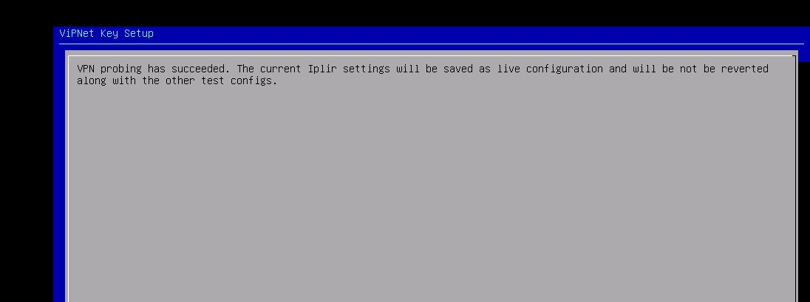

Далее → далее → перезагрузка координатора. Входить необязательно — настроенный координатор работает сам.

При успехе связь появится в двух клиентах:

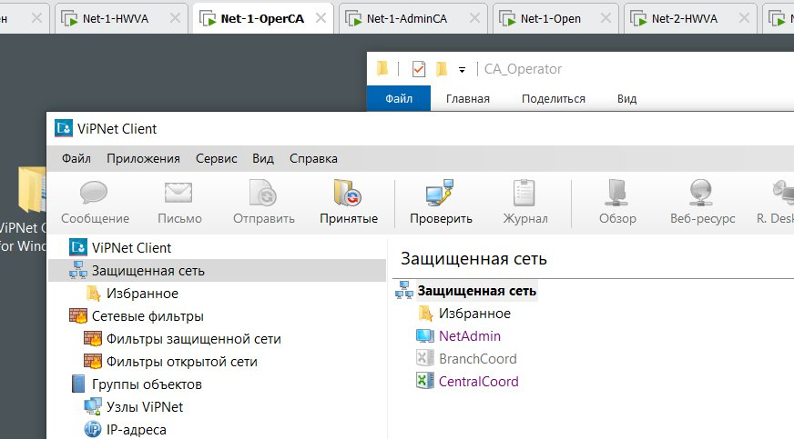

## Второй координатор (Net2-HW-VA)

Выставляем сегменты **2 и 3**:

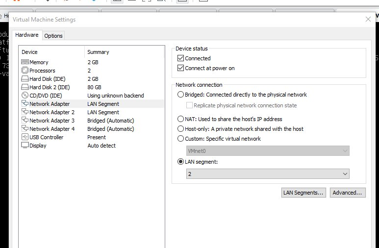

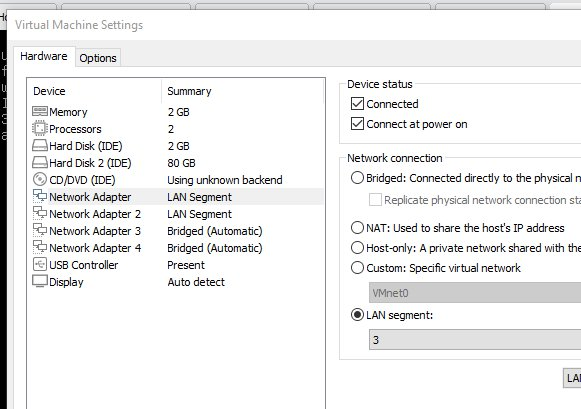

Инициализируем так же, как первый. dst-файл берём из iso.

- **Первый интерфейс (сегмент 2):** `10.10.20.130` (маска `255.255.255.128`)
- **Второй интерфейс:** `10.8.248.20`
- 3-й и 4-й интерфейс **НЕ** активируем:

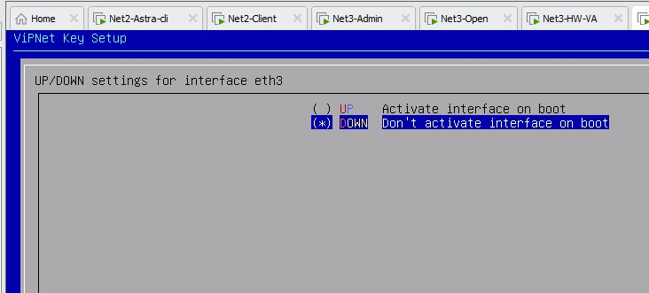

Шлюзом указываем **IP первого координатора** (тот, что смотрит в «Интернет»).
Next → next, название — **Координатор Филиала** (таблица 1).

## Проверка соединения

Выполняем проверку:

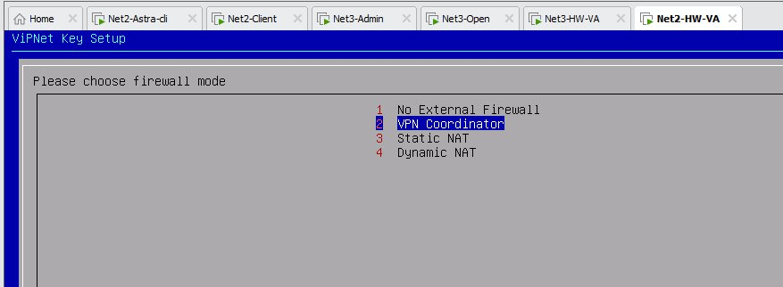

Выбираем проверку по второму интерфейсу (с цифрой 1). Выбираем **Координатор Офис** для проверки связи, указываем IP первого координатора, запускаем.

> Если не работает — выйти из фильтра проверки, выбрать отмену проверки, затем **Да** на вопросе о старте VPN-сервиса. ⚠️ Если нажать **Нет** — придётся инициализировать всё заново.

При успехе на **Net1-Admin** появится связь с **RemoteUser**:

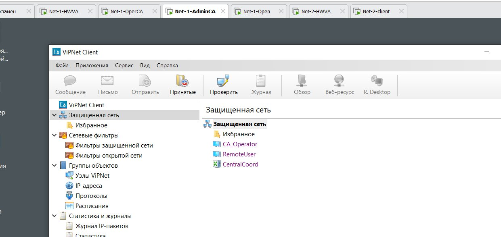

Должна появиться связь с Админом из первой сети, а также у AdminCA и OperCA — с координатором филиала и Пользователем 2 (в идеале и с пользователем 3 / астра).

### Диагностика

Координаторы должны пинговаться между собой:

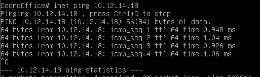

И VPN-соединение должно пинговаться:

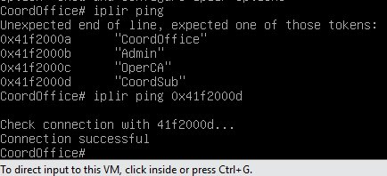

> Если ничего не работает — имеет смысл откатить снапшот на 0 и сделать заново.

## Проверка связи между сетями (в отчёт)

Из первой сети во вторую и обратно выполняем **Проверку** — обязательно скриншоты в отчёт:

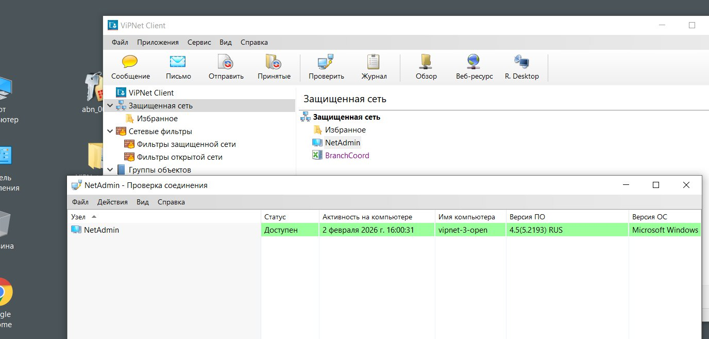

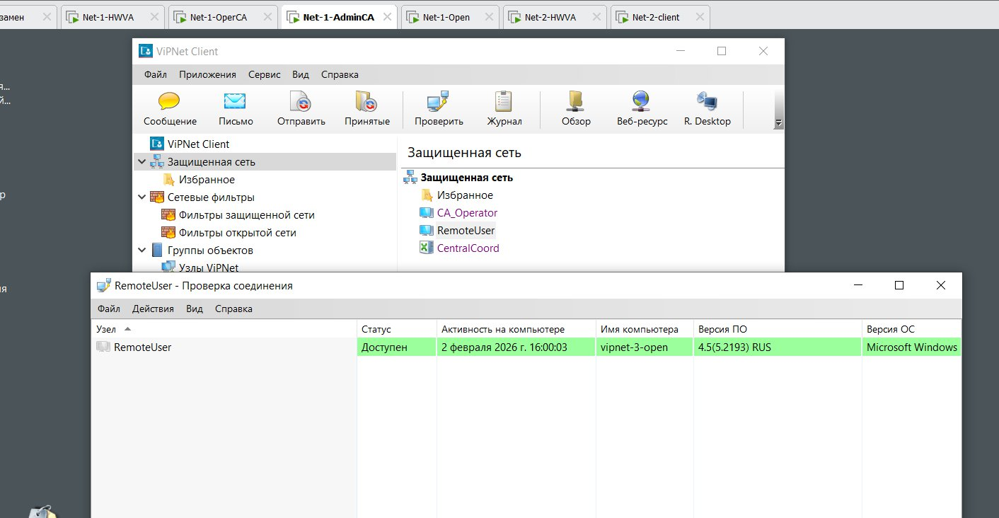

Обязательно скриншоты о наличии связи и видимости из одной сети в другую.

## Чат и деловая почта (Задание 3.2 / 3.3)

> **Сообщение** — это чат, **Письмо** — это деловая почта.

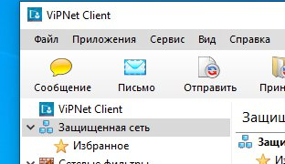

Написанное и отправленное сообщение:

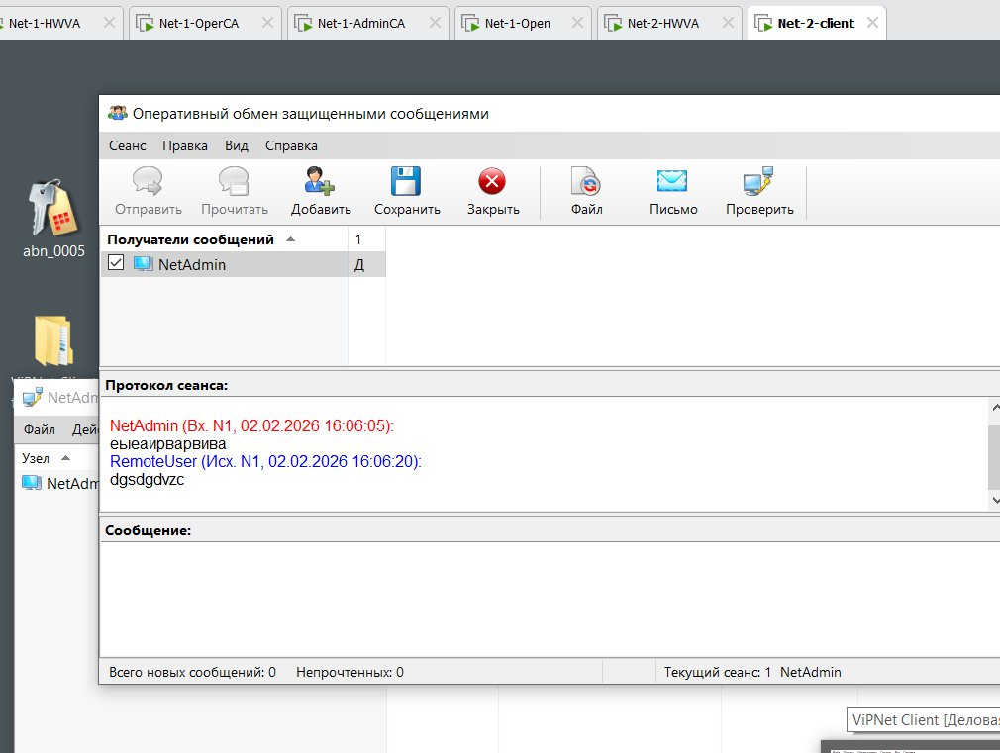

> Деловую почту можно открыть из меню Пуск, если не открывается сама при входящих.

Письмо в исходящих по зашифрованному каналу:

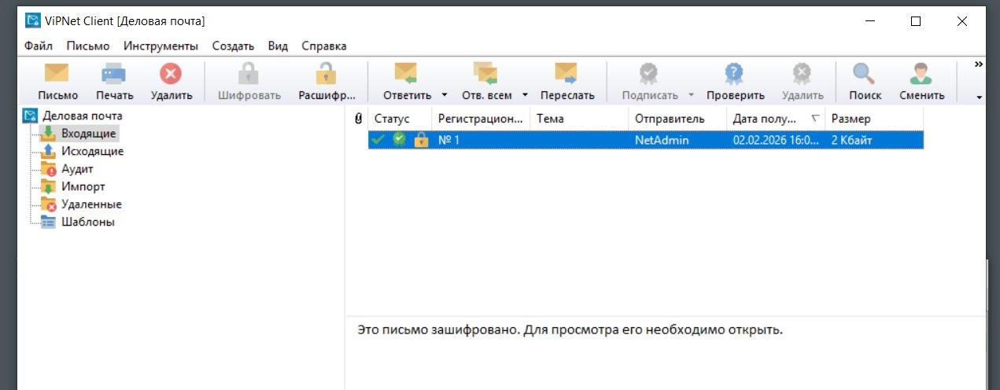

В идеале — скриншоты получения почты и сообщений чата из **обеих** сетей (между пользователями Офиса и Филиала).

> ✅ Выполнены задания **3.1, 3.2, 3.3**.

---

| ⬅️ Назад | 🏠 | Вперёд ➡️ |
|---|---|---|
| [Задание 2.2/2.3](03-zadanie-2-2-koordinatory-klyuchi.md) | [Содержание](README.md) | [Задание 4.1 — Доп. софт](05-zadanie-4-1-dop-soft.md) |
