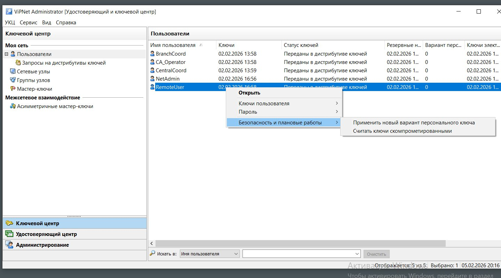
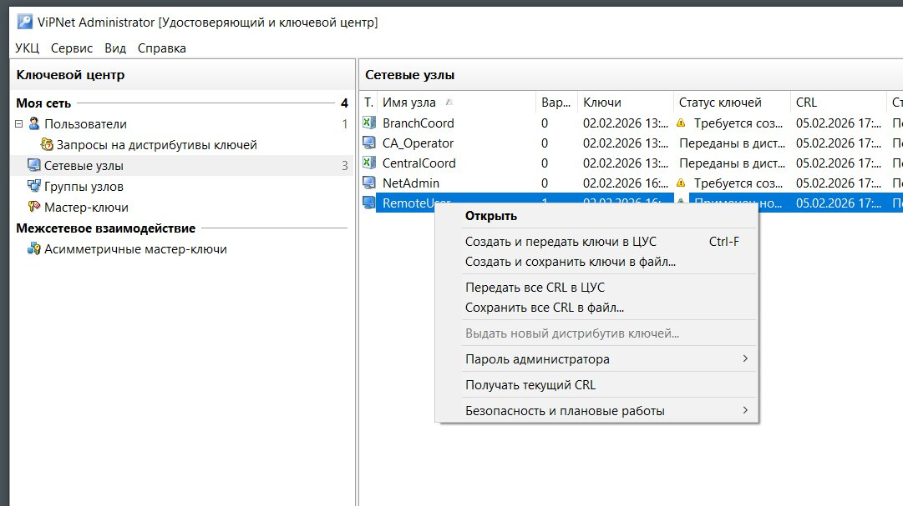
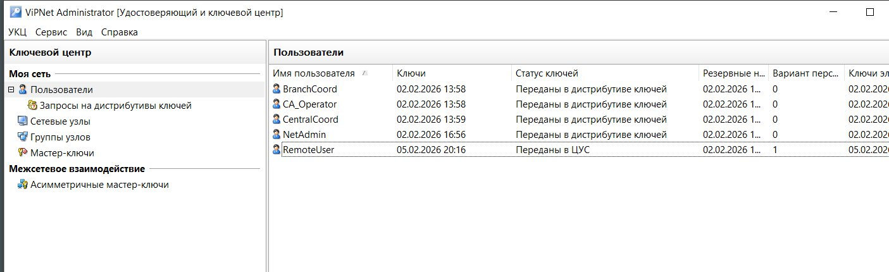
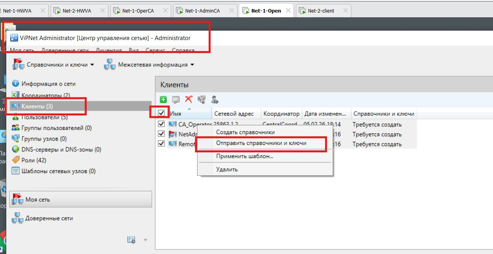
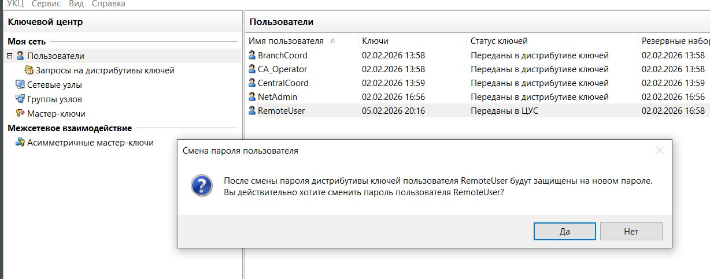
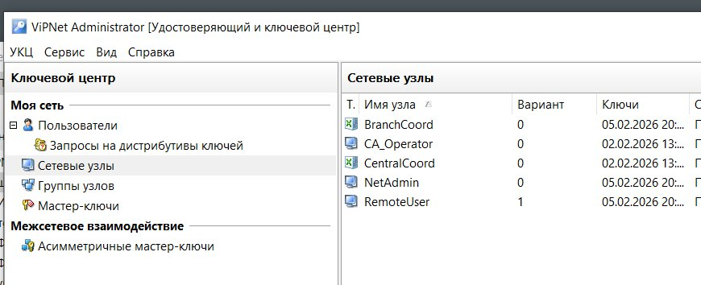
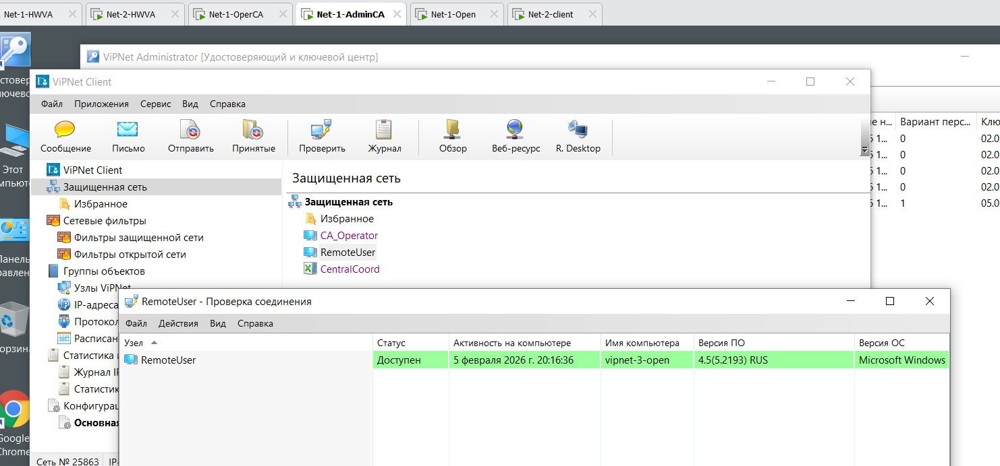
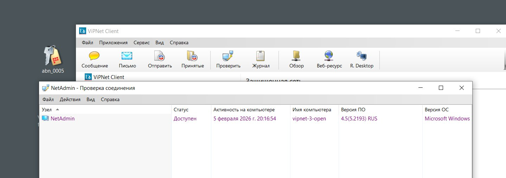
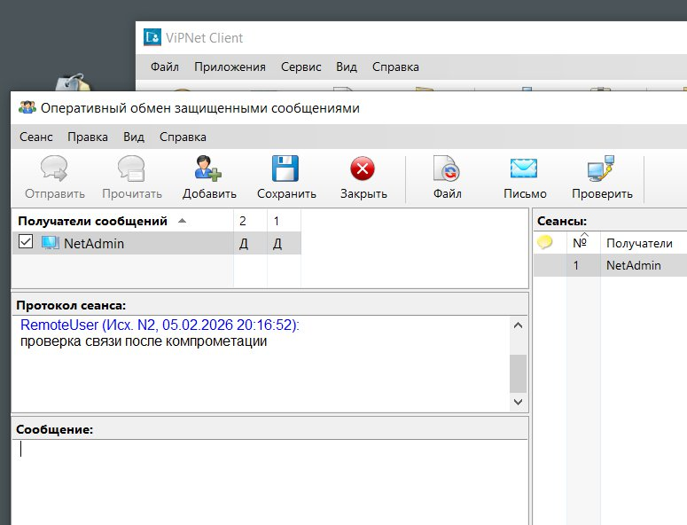
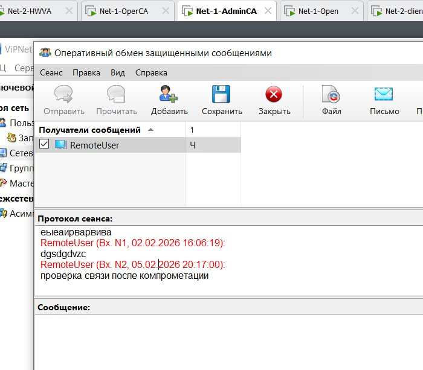

[🏠 Главная](index.md)

# Задание 5.2 — компрометация пользователя

## Считаем ключи скомпрометированными

Сначала считаем ключи пользователя **скомпрометированными**:

Идём в **Сетевые узлы** и **создаём новые ключи**:

Затем для **координаторов** тоже создаём и **передаём ключи в ЦУС**. В результате у всех узлов — запись **«Переданы…»**.

На пользователе выбираем **Выдать новый дистрибутив ключей** — создаётся сертификат, везде Далее → далее:

## Перевыдача на удалённом пользователе

На **удалённом пользователе** выходим из Клиента (в системном трее — **Выход**; просто закрыв окно, Клиент не закрывается). Заходим заново.

Идём в **ЦУС** и выдаём **справочники и ключи**:

Должна появиться информация **«ОТПРАВЛЕНЫ»**.

## Смена пароля удалённому пользователю

> Чтобы не забыть, можно поставить похожий пароль — **в отчёт записывать обязательно!**

## Проверка связи после компрометации

В отчёт нужны:
- скриншот с **цифрой 1** — доказывает, что ключи выдавались повторно;
- скриншот проверки связи **Админ ↔ Удалённый пользователь** (в обе стороны);
- скриншот сообщения чата с Удалённого пользователя на Админа.

Скрин с выдачей ключей (цифра 1):

Проверка связи в обе стороны:

Отправка сообщения из чата:

Приход сообщения на Админа:

> ✅ Задание 5.2 выполнено. Все скриншоты — в отчёт.

---

| ⬅️ Назад | 🏠 | Конец |
|---|---|---|
| [Задание 5.1](06-zadanie-5-1-akkreditaciya.md) | [Содержание](index.md) | 🎉 Готово |
