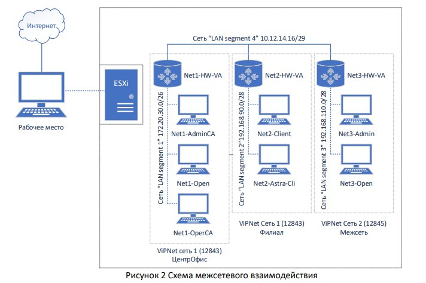

# ViPNet — демоэкзамен: пошаговая инструкция

Сборка защищённой сети на **ViPNet** (Инфотекс): центральный офис, филиал, координаторы, УЦ.
Каждое задание вынесено в отдельный файл. Внизу каждой страницы — навигация «← Назад / Вперёд →».

## Содержание

| № | Этап | Файл |
|---|------|------|
| 0 | Подготовка: общие папки, IP-адресация, сегменты, пинг | [Подготовка →](00-podgotovka.md) |
| 1 | **Задание 1.1** — установка БД MSSQL на Net1-Open | [Задание 1.1 →](01-zadanie-1-1-mssql.md) |
| 2 | **Задание 2.1** — установка и настройка ЦУС + УКЦ | [Задание 2.1 →](02-zadanie-2-1-cus-ukc.md) |
| 3 | **Задание 2.2 / 2.3** — координаторы, клиенты, роли, ключи | [Задание 2.2/2.3 →](03-zadanie-2-2-koordinatory-klyuchi.md) |
| 4 | **Задание 3.1–3.3** — координаторы HW-VA, VPN, чат и почта | [Задание 3 →](04-zadanie-3-koordinatory-hwva.md) |
| 5 | **Задание 4.1** — установка дополнительного софта | [Задание 4.1 →](05-zadanie-4-1-dop-soft.md) |
| 6 | **Задание 5.1** — аккредитованный УЦ, сертификаты, публикация | [Задание 5.1 →](06-zadanie-5-1-akkreditaciya.md) |
| 7 | **Задание 5.2** — компрометация пользователя | [Задание 5.2 →](07-zadanie-5-2-komprometaciya.md) |

---

## Схема межсетевого взаимодействия

- **Net1-Admin (AdminCA), Net1-Open, Net1-OperCA, Net2-Client** — виртуальные машины с **Windows 10**.
- **Net1-HW-VA, Net2-HW-VA** — готовые виртуальные машины от Инфотекса (Linux), это **координаторы**.

---

## Виртуальные машины и софт (для заданий 1–3)

Софт удобно «раскидать» по машинам заранее — через общую папку VMware Tools (см. [Подготовка](00-podgotovka.md)).

| Виртуальная машина | Что установить | Сегмент |
|--------------------|----------------|---------|
| **Net1-AdminCA** | ViPNet Administrator (**ЦУС-сервер** + **УКЦ**), **ViPNet Client**, ViPNet CA Informing¹ | 1 |
| **Net1-Open** | **MS SQL** (SQLEXPR_x64_ENU), **ЦУС-клиент** | 1 |
| **Net1-OperCA** | **ViPNet Client**, ViPNet Registration Point¹, ViPNet Publication Service¹ | 1 |
| **Net2-Client** | **ViPNet Client** | 2 |
| **Net1-HW-VA** | координатор (инициализация dst-файлом) | 1 + 3 |
| **Net2-HW-VA** | координатор (инициализация dst-файлом) | 2 + 3 |

¹ Registration Point / Publication Service / CA Informing нужны только для заданий 4–5.

---

## Пути к установщикам (исполняемым файлам)

> Предполагается, что софт скопирован на **Рабочий стол** пользователя `student`.
> Если копировали в другое место — поправьте начало пути.

**Софт заданий 1–3:**

| Программа | Машина | Путь к установщику |
|-----------|--------|--------------------|
| **MS SQL Server** | Net1-Open | `Z:\soft\ViPNet Administrator 4.6.9\ЦУС\Server Install\Packages\SqlExpress2014\SQLEXPR_x64_ENU.exe` — установщик SQL входит в дистрибутив ViPNet, открывается из общей папки `soft` (диск `Z:` = Shared Folders `\\vmware-host`) |
| **ЦУС — Сервер** | Net1-AdminCA | `C:\Users\student\Desktop\ViPNet Administrator 4.6.7_R1\Комплект пользователя\ГОСТ\Soft\Центр управления сетью\Server Install\Setup.exe` |
| **ЦУС — Клиент** | Net1-Open | `C:\Users\student\Desktop\ViPNet Administrator 4.6.7_R1\Комплект пользователя\ГОСТ\Soft\Центр управления сетью\Client Install\setup.exe` |
| **УКЦ** (Удостоверяющий и ключевой центр) | Net1-AdminCA | `C:\Users\student\Desktop\ViPNet Administrator 4.6.7_R1\Комплект пользователя\ГОСТ\Soft\Удостоверяющий и ключевой центр\setup.exe` |
| **ViPNet Client** | Net1-AdminCA, Net1-OperCA, Net2-Client | `C:\Users\student\Desktop\ViPNet Client for Windows 4.5.5\Комплект пользователя\RUS\Software\setup.exe` |

**Софт заданий 4–5** (отдельные папки дистрибутива, скопированные на Рабочий стол — видно на скриншотах):

| Программа | Машина | Где запускать |
|-----------|--------|---------------|
| **ViPNet Registration Point** (Пункт регистрации) | Net1-OperCA | папка `ViPNet Registration Point` на Рабочем столе → `setup` |
| **ViPNet Publication Service** (Сервис публикации) | Net1-OperCA | папка `Publication Service 4.6.9` на Рабочем столе → `setup` |
| **ViPNet CA Informing** (Сервис информирования) | Net1-AdminCA | папка `CaInforming 4.6.9` на Рабочем столе → `setup` |

**Прочее:**

| Объект | Машина | Путь |
|--------|--------|------|
| **Папка данных УКЦ** (расшаривается на задании 5.1) | Net1-AdminCA | `C:\ProgramData\InfoTeCS\ViPNet Administrator\KC` |

> ℹ️ В тексте инструкции фигурирует версия `ViPNet Administrator 4.6.7_R1`, а на скриншотах — `4.6.9`. Если у вас другая версия, поправьте номер в путях.

---

## IP-план (отчёт)

**Центральный офис «Сеть 1 ЦО»: `172.16.224.224/27`**, маска `255.255.255.224`

| Узел | IP |
|------|----|
| Net1-Coord | `172.16.224.230` |
| Net1-AdminCA | `172.16.224.231` |
| Net1-OperCA | `172.16.224.232` |
| Net1-Open | `172.16.224.233` |

**Офис филиал «Сеть 1 Филиал»: `10.10.20.128/25`**, маска `255.255.255.128`

| Узел | IP |
|------|----|
| Net2-Coord | `10.10.20.130` |
| Net2-Client | `10.10.20.131` |

**«Интернет» для координаторов: `10.8.248.0/24`**, маска `255.255.255.0`

| Узел | IP |
|------|----|
| Net1-Coord | `10.8.248.10` |
| Net2-Coord | `10.8.248.20` |

**Сеть 2 «Сеть 2 Офис»: `192.168.88.64/26`**

**Шлюзы:**
- В «Сети 1 ЦО» шлюз = IP координатора **Net1-Coord** (`172.16.224.230`).
- В «Сети 1 Филиал» шлюз = IP координатора **Net2-Coord** (`10.10.20.130`).

---

➡️ **Начать:** [Подготовка →](00-podgotovka.md)
